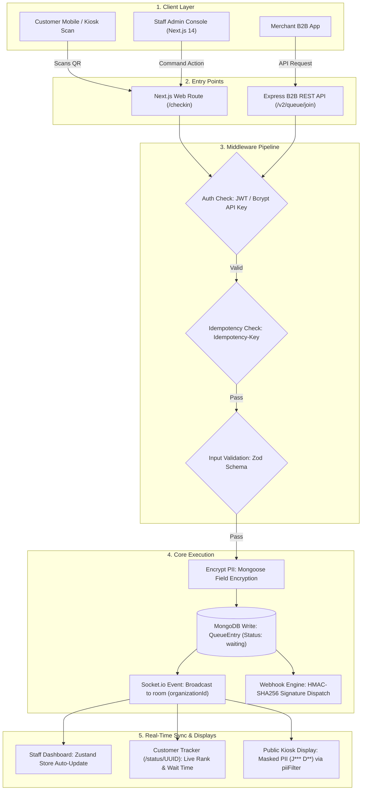

# Flow-Q: Next-Gen Real-Time Queue & Appointment Management Platform

> **Built by:** Nadam Eshwanth Raj & Ambilpur Vaishnav

---

## 1. Problem & Solution

### Problem
* **Congested Waiting Rooms:** High physical density creates discomfort and health risks.
* **Zero Queue Visibility:** Customers lack real-time insights into waiting position and estimated arrival time.
* **Manual Operational Overhead:** Staff manually manage paper logs, causing human error, missed slots, and low throughput.

### Solution
* **Zero-Install Mobile Check-in:** Customers scan QR codes and join queues instantly via web browsers without app downloads.
* **Live Position Tracking:** Mobile status view (`/status/[uuid]`) displays live rank and dynamic estimated wait time.
* **Real-time Command Console:** Staff call, serve, pause, and cancel queue entries in one click from an interactive dashboard.
* **Multi-Tenant B2B QaaS:** Headless REST API with API key security and HMAC webhooks to power external business workflows.

---

## 2. Flow of Execution of the Project



---

## 3. Important Architectural Tradeoffs

* **In-Memory PII Decryption vs. Native Database Indexing:**
  * *Tradeoff:* Encrypting PII at rest prevents MongoDB native regex and text searches.
  * *Decision:* Query candidate records by unencrypted metadata (`organizationId`, `status`), then decrypt and filter in memory. Accepts higher CPU/RAM usage to prevent plain-text PII storage in database.

* **WebSocket Rooms vs. Client HTTP Polling:**
  * *Tradeoff:* Maintaining persistent WebSocket connections consumes server RAM and TCP sockets.
  * *Decision:* Eliminates HTTP polling overhead and guarantees sub-100ms state updates across all connected devices.

* **Nested Document Schemas vs. Relational Normalization:**
  * *Tradeoff:* Embedding locations and service settings inside `Organization` document risks document size limits.
  * *Decision:* Eliminates `$lookup` joins, optimizing single-document fetch speed for high-concurrency check-in routes.

* **Synchronous Webhook Delivery vs. Asynchronous Message Queue:**
  * *Tradeoff:* Firing webhooks inline during API requests blocks response threads if third-party servers lag.
  * *Decision:* Simplifies initial architecture by removing message broker overhead, with immediate timeout safeguards in place.

* **Stateless Session Tokens (JWT) vs. Stateful DB Sessions:**
  * *Tradeoff:* Access tokens cannot be revoked instantly before expiry without maintaining a token blacklist.
  * *Decision:* Eliminates database reads on every authenticated HTTP request, reducing database read bottleneck.

---

## 4. How to Scale It

* **Stateless WebSockets with Redis Adapter:**
  * Deploy Node.js server instances behind an Application Load Balancer (ALB).
  * Integrate `@socket.io/redis-adapter` with Redis Pub/Sub to broadcast WebSocket events across all server nodes seamlessly.

* **Database Sharding & Read-Write Separation (MongoDB):**
  * Route read traffic (public monitors, customer status pages) to Secondary Replicas using `secondaryPreferred`.
  * Shard MongoDB cluster using `organizationId` as the shard key to isolate tenant data and localize query operations.

* **Asynchronous Task Queue (BullMQ + Redis):**
  * Offload SMS alerts (Fast2SMS) and B2B webhook retries from Express HTTP threads to BullMQ background workers.
  * Return immediate `201 Created` responses while workers process retries asynchronously with exponential backoff.

* **In-Memory Caching (Redis):**
  * Cache verified API keys (1-hour TTL) in Redis for sub-millisecond auth checks.
  * Cache idempotency locks and response payloads in Redis to prevent DB lock contention during high-concurrency double-clicks.

* **Blind Indexing for Encrypted Search:**
  * Replace in-memory decryption filtering with HMAC-salted blind indexes for fast, indexed queries on encrypted customer data.

---

## 5. Developer Quick Start

* **Prerequisites:** Node.js (v18+), MongoDB.

* **Backend Setup:**
  ```bash
  cd backend
  npm install
  npm run dev
  ```

* **Frontend Setup:**
  ```bash
  cd frontend-next
  npm install
  npm run dev
  ```

* **Run Tests:**
  ```bash
  cd backend
  npm run test:unit
  node tests/test-all-endpoints.js
  ```
