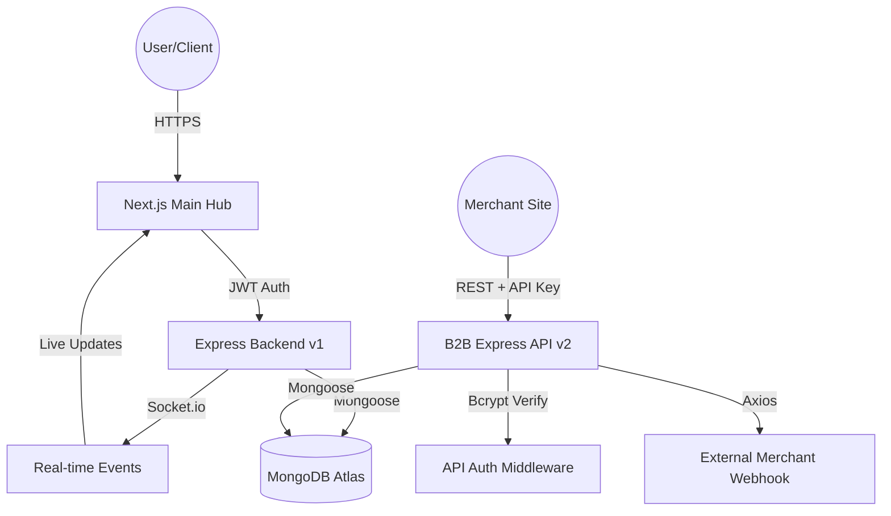

# Flow-Q: Next-Gen Real-Time Queue & Appointment Management SaaS

Flow-Q is a multi-tenant, real-time platform designed to digitize and optimize customer flow management. By eliminating physical queues, Flow-Q allows businesses, ranging from healthcare clinics and salons to bank branches, to manage customer flow through a live command console. Simultaneously, it provides customers with a transparent waiting experience via mobile devices without requiring any native app downloads.

---

## Developer and Architect Team

* Nadam Eshwanth Raj
* Vaishnav Ambilpur
* Vangala Varshith Reddy
* Balaka Laluth Vardhan

---

## System Overview and Problem/Solution Model

### The Waiting Crisis
In traditional service sectors, physical queues create:
* Congested Waiting Rooms: High density increases health risks and causes occupant frustration.
* Lack of Visibility: Customers lack real-time insights into estimated wait times and queue positions.
* Operational Inefficiency: Staff must manage queue flow via manual logs, leading to human error, missed appointments, and unoptimized throughput.

### The Flow-Q Solution
We bridge the gap between service providers and customers through:
1. Fast Digital Check-in: Customers scan a QR code to join the queue instantly via a web tracking page.
2. Live Position Tracking: A personalized tracking page showing live position (e.g., Rank 3) and estimated wait times.
3. Command Center: A real-time web dashboard for staff to call, pause, cancel, or complete queue entries with a single click.
4. Multi-Tenant Architecture: A secure system capable of hosting multiple distinct organizations in strict data isolation.

---

## Technical Architecture

Flow-Q is split into two core planes: the Main Hub (Control Plane) and the B2B API (Execution Plane).

### System Data Flow



### Technical Stack Matrix

| Layer | Technology | Key Implementation |
| :--- | :--- | :--- |
| Frontend | Next.js 14 | Server-Side Rendering (SSR) for fast initial status page loads. |
| Backend | Node.js / Express | Event-driven backend handling high-concurrency operations. |
| Real-Time Sync | Socket.io | Persistent WebSockets providing low-latency status updates across all connected displays. |
| Database | MongoDB | Multi-tenant schema design with data isolation and optimized indexing. |
| Security | JWT / Cookies | Secure session authentication with Refresh Token Rotation and HTTP-only cookies. |
| Logging | Winston | Structured JSON logging and request tracing. |
| SMS Notification | Fast2SMS | SMS gateway integration for patient notifications. |

---

## Pillar 1: The Main Hub (Control Plane)

The Main Hub is a Next.js 14 console designed for administrators, operators, and developers.

### Component Responsibility Matrix
* AdminNavbar: High-privilege navigation options reserved for Flow-Q platform operators.
* Navbar: Dynamic, role-based navigation bar for Organization Admins and Local Operators.
* ProtectedRoute: Guard component that checks authenticated states via Zustand, preventing unnecessary DOM paint cycles.
* Background3D: Performance-optimized Three.js scene utilizing RequestAnimationFrame and OrbitControls for the developer portal interface.

### Global State Management (Zustand)
Flow-Q uses Zustand to decouple state from React rendering trees, mitigating re-render overhead:
* Auth Persistence (useAuthStore.ts): Syncs the JSON state with localStorage using standard persist middleware. An API interceptor references this state directly, ensuring that valid tokens are included in Authorization headers.
* Canvas Bridge (useAppStore.ts): Holds semantic UI state (e.g., selectedNodeId). Components in the Three.js Canvas subscribe to specific slices, preventing dashboard-wide React re-renders.

### Real-Time Synchronization Layer
* Global WebSockets: The client dashboard establishes a persistent Socket.io connection.
* Room Separation: Upon successful authentication, clients join a WebSocket room uniquely keyed by their organizationId.
* State Change Propagation: High-priority events (e.g., status_changed) trigger silent data-slice refreshes, updating counters, queues, and dashboard stats instantly.

---

## Pillar 2: The B2B Headless API (v2 Execution Plane)

Flow-Q provides a headless Queue-as-a-Service (QaaS) platform allowing third-party applications to leverage our queue state machine.

### Key Offerings
* Headless QaaS: All queue operations (Check-in, Call, Complete, Cancel) are exposed via RESTful endpoints.
* Sandbox Provisioning (/v2/demo/provision): One-click sandbox generation that provisions a fresh Organization, default Services, and a brand-new API key in a single atomic database operation.
* Unique Link Status Tracking: Customers are mapped to a UUID-based tracking link (/status/[uuid]) for secure, public mobile access.
* Webhook Engine: Emits webhook notifications to merchant systems when entries are created, called (served), or completed.
* Intelligent Slot Generation: Calculates available appointment slots based on historical average session durations.

### The API Key Pipeline (apiAuth.js)
Security for the B2B API is verified via a secure verification process:
1. Key Format: Keys are structured as sq_test_&lt;Base64_ID&gt;_&lt;Bcrypt_Hash&gt;.
2. Lookup: The middleware extracts the Base64-encoded ID and runs a findById query against the ApiKey collection.
3. Verification: If found, the middleware compares the incoming Bcrypt Hash against the stored hash using bcrypt.compare() to ensure high-entropy security.
4. Tenant Injection: Once verified, the organizationId is bound to the request object. Downstream controllers use this ID to isolate database queries.

### Multi-Tenant Data Masking (piiFilter.js)
To comply with security standards, the API masks sensitive data:
* Sandbox Keys: Full customer details are returned to ease API development.
* Production Keys: Customer names are masked (e.g., John Doe becomes J*** D**) unless the include_pii query parameter is specified and the API key possesses the PII_ACCESS permission.

### Webhook Dispatcher and HMAC Verification
* Mechanism: Dispatches event payloads to registered merchant endpoints using an exponential backoff retry strategy.
* Security: Every webhook request contains an x-smartqueue-signature header. This signature is an HMAC-SHA256 digest of the payload generated using the merchant's webhook secret, establishing non-repudiation.

---

## Core Database Schemas

### Organization Schema (models/Organization.js)
* Identity: Contains name, unique lowercase slug, and unique email.
* Industry Segments: Classified under enum values: ["healthcare", "banking", "government", "education", "salon", "retail", "other"].
* Multi-Location: Supports an array of locations, each having a name, address, and isActive status flag.
* Governance: Controls subscriptionPlan (Starter/Growth/Enterprise), dataRetention periods, and status (Active/Suspended).
* Configuration: Flags for allowWalkIn, allowAppointments, and kioskEnabled.

### Service Schema (models/Service.js)
* Mapping: Associated directly with an organizationId.
* Metrics: Contains avgSessionDuration (Number), which determines slot availability and wait-time estimations.
* Assignment: References the User ID of the agent assigned to perform the service.

### Queue Entry Schema (models/QueueEntry.js)
* Vitals: Client name and phone number (encrypted at rest using mongoose-field-encryption).
* Tracking: Tracks tokenNumber (auto-incrementing per organization and day) and uniqueLinkId (UUID used for tracking links).
* State Machine: Managed via state changes: ["waiting", "serving", "completed", "cancelled", "no-show"].

---

## Security and Compliance Matrix

| Security Threat | Mitigation Strategy | Implementation |
| :--- | :--- | :--- |
| XSS Attacks | Content Security Policy and Escaping | Helmet middleware and React rendering mechanisms |
| NoSQL Injection | Input Sanitization | Express Mongo Sanitize middleware |
| PII Exposure | Field-level Encryption | Mongoose Field Encryption plugin |
| API Abuse | Key Scoping and Rate Limiting | Express Rate Limit middleware and custom key verification |
| Session Hijacking | JWT Validation and Secure Cookies | JSON Web Tokens with Secure and HttpOnly cookie flags |
| Data Integrity | Zod Schema Validation | Parsing incoming REST inputs using strict Zod models |

---

## Installation and Setup

### Prerequisites
* Node.js (v18 or higher)
* MongoDB (Local instance or MongoDB Atlas)

### Local Configuration
Create a `.env` file inside both `/backend` and `/frontend-next` directories based on their respective `.env.example` templates.

Example Backend Environment Variables (`backend/.env`):
```env
MONGODB_URL=mongodb://localhost:27017/flowq
PORT=5000
JWT_SECRET=your_jwt_secret_key
NODE_ENV=development
GOOGLE_CLIENT_ID=your_google_client_id
GOOGLE_CLIENT_SECRET=your_google_client_secret
GOOGLE_CALLBACK_URL=http://localhost:5000/api/auth/google/callback
FRONTEND_URL=http://localhost:3000
FIELD_ENCRYPTION_SECRET=your_32_character_encryption_secret
```

### Installation Steps

1. Clone the repository:
   ```bash
   git clone https://github.com/your-org/flow-q.git
   cd flow-q
   ```

2. Setup and run the Backend:
   ```bash
   cd backend
   npm install
   npm run dev
   ```

3. Setup and run the Frontend:
   ```bash
   cd ../frontend-next
   npm install
   npm run dev
   ```

### Running Test Suites
All backend tests are located inside the `backend/tests/` directory:
* Jest Unit Tests: To run the unit tests, execute:
  ```bash
  cd backend
  npm run test:unit
  ```
* Full End-to-End API Integration Script: To run the comprehensive API validation script (requires a running server on port 5000), execute:
  ```bash
  node backend/tests/test-all-endpoints.js
  ```

---

## Future Roadmap

* AI Analytics: Predictive wait-time calculations derived from historical session duration trends.
* SMS Notifications: Fallback text notifications via Fast2SMS for users without active mobile data connections.
* Advanced Hybrid Scheduling: Integrated calendar synchronization supporting both walk-ins and reserved appointments.

---

## Key System Flows and Implementation Details

### Multi-Tenant Architecture & Data Isolation
Flow-Q utilizes a robust multi-tenant strategy where all collections are logically isolated by `organizationId`. 
Authentication is managed via HTTP-only JWT cookies containing the user's role and organization ID, which the auth middleware binds to `req.user`. Downstream routes construct query filters referencing `req.user.organizationId`, ensuring tenants cannot read or mutate another tenant's records.

### Field-Level Encryption & Query Design
To safeguard patient privacy (PII), customer names and contact numbers are encrypted at rest using the Mongoose Field Encryption plugin. 
Because fields are encrypted, standard database-level query operations like pattern matching or regex matching are not possible. Therefore, search capabilities (such as the patient history search by name) are designed using an in-memory decryption and filtering pipeline:
1. Retrieve candidate customer documents filtering on unencrypted fields (`organizationId`, `agentId`, `status`).
2. Decrypt records in-memory using the model's `decryptFieldsSync()` interface.
3. Filter the decrypted records according to the search term.

### Real-Time WebSocket Updates
Real-time state transitions (enrolling, calling, completing, or cancelling) are propagated using Socket.io. Clients join organization-specific channels upon authentication. Emitted events notify dashboards and kiosk displays of queue updates immediately, maintaining high-fidelity display synchronization with minimal latency.

